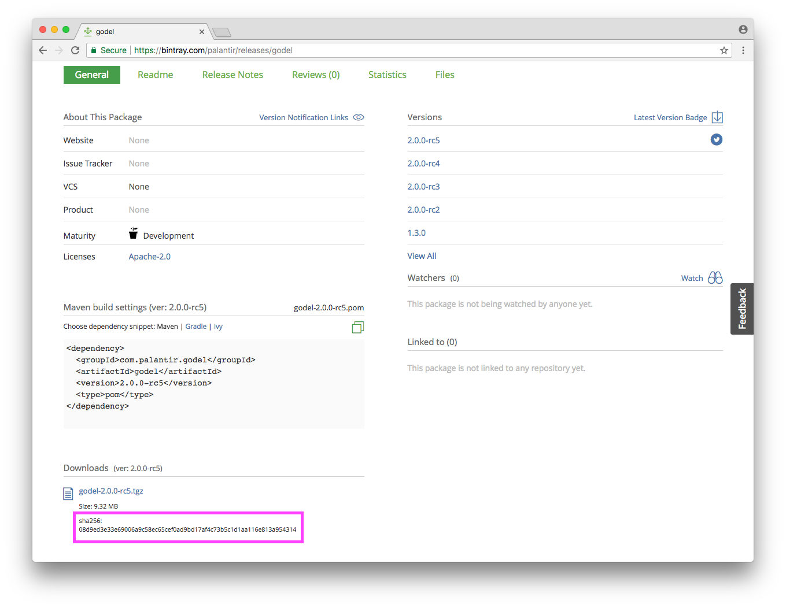

Summary
-------
Install and run `godelinit` to add gödel to a project.

Tutorial start state
--------------------
* `${GOPATH}/src/${PROJECT_PATH}` exists, is the working directory and is initialized as a Git repository

Add gödel to a project
----------------------
The godelinit program can be used to add gödel to a new project. The godelinit program determines the latest release of
gödel and installs it into the current directory, downloading it if needed.

Install the `godelinit` program using `go get` and run the program to install gödel:

```
➜ go get github.com/palantir/godel/godelinit
➜ godelinit
Getting package from https://palantir.bintray.com/releases/com/palantir/godel/godel/2.0.0-rc5/godel-2.0.0-rc5.tgz...
 9.32 MiB / 9.32 MiB  100.00% 8s
```

Run `./godelw version` to verify that gödel was installed correctly. If this is the first run, this invocation will
download all of the plugins and assets:

```
➜ ./godelw version
Getting package from https://palantir.bintray.com/releases/com/palantir/distgo/dist-plugin/1.0.0-rc6/dist-plugin-1.0.0-rc6-linux-amd64.tgz...
 4.72 MiB / 4.72 MiB  100.00% 3s
Getting package from https://palantir.bintray.com/releases/com/palantir/godel-format-plugin/format-plugin/1.0.0-rc5/format-plugin-1.0.0-rc5-linux-amd64.tgz...
 3.32 MiB / 3.32 MiB  100.00% 2s
Getting package from https://palantir.bintray.com/releases/com/palantir/godel-format-asset-ptimports/ptimports-asset/1.0.0-rc4/ptimports-asset-1.0.0-rc4-linux-amd64.tgz...
 3.60 MiB / 3.60 MiB  100.00% 2s
Getting package from https://palantir.bintray.com/releases/com/palantir/godel-goland-plugin/goland-plugin/1.0.0-rc2/goland-plugin-1.0.0-rc2-linux-amd64.tgz...
 3.09 MiB / 3.09 MiB  100.00% 2s
Getting package from https://palantir.bintray.com/releases/com/palantir/okgo/check-plugin/1.0.0-rc4/check-plugin-1.0.0-rc4-linux-amd64.tgz...
 3.53 MiB / 3.53 MiB  100.00% 2s
Getting package from https://palantir.bintray.com/releases/com/palantir/godel-okgo-asset-compiles/compiles-asset/1.0.0-rc3/compiles-asset-1.0.0-rc3-linux-amd64.tgz...
 3.71 MiB / 3.71 MiB  100.00% 2s
Getting package from https://palantir.bintray.com/releases/com/palantir/godel-okgo-asset-deadcode/deadcode-asset/1.0.0-rc2/deadcode-asset-1.0.0-rc2-linux-amd64.tgz...
 3.73 MiB / 3.73 MiB  100.00% 2s
Getting package from https://palantir.bintray.com/releases/com/palantir/godel-okgo-asset-errcheck/errcheck-asset/1.0.0-rc2/errcheck-asset-1.0.0-rc2-linux-amd64.tgz...
 3.81 MiB / 3.81 MiB  100.00% 2s
Getting package from https://palantir.bintray.com/releases/com/palantir/godel-okgo-asset-extimport/extimport-asset/1.0.0-rc2/extimport-asset-1.0.0-rc2-linux-amd64.tgz...
 3.36 MiB / 3.36 MiB  100.00% 2s
Getting package from https://palantir.bintray.com/releases/com/palantir/godel-okgo-asset-golint/golint-asset/1.0.0-rc3/golint-asset-1.0.0-rc3-linux-amd64.tgz...
 3.88 MiB / 3.88 MiB  100.00% 2s
Getting package from https://palantir.bintray.com/releases/com/palantir/godel-okgo-asset-govet/govet-asset/1.0.0-rc3/govet-asset-1.0.0-rc3-linux-amd64.tgz...
 3.17 MiB / 3.17 MiB  100.00% 2s
Getting package from https://palantir.bintray.com/releases/com/palantir/godel-okgo-asset-importalias/importalias-asset/1.0.0-rc2/importalias-asset-1.0.0-rc2-linux-amd64.tgz...
 3.38 MiB / 3.38 MiB  100.00% 2s
Getting package from https://palantir.bintray.com/releases/com/palantir/godel-okgo-asset-ineffassign/ineffassign-asset/1.0.0-rc2/ineffassign-asset-1.0.0-rc2-linux-amd64.tgz...
 3.35 MiB / 3.35 MiB  100.00% 2s
Getting package from https://palantir.bintray.com/releases/com/palantir/godel-okgo-asset-novendor/novendor-asset/1.0.0-rc2/novendor-asset-1.0.0-rc2-linux-amd64.tgz...
 3.41 MiB / 3.41 MiB  100.00% 2s
Getting package from https://palantir.bintray.com/releases/com/palantir/godel-okgo-asset-outparamcheck/outparamcheck-asset/1.0.0-rc2/outparamcheck-asset-1.0.0-rc2-linux-amd64.tgz...
 3.84 MiB / 3.84 MiB  100.00% 2s
Getting package from https://palantir.bintray.com/releases/com/palantir/godel-okgo-asset-unconvert/unconvert-asset/1.0.0-rc3/unconvert-asset-1.0.0-rc3-linux-amd64.tgz...
 3.91 MiB / 3.91 MiB  100.00% 2s
Getting package from https://palantir.bintray.com/releases/com/palantir/godel-okgo-asset-varcheck/varcheck-asset/1.0.0-rc2/varcheck-asset-1.0.0-rc2-linux-amd64.tgz...
 3.75 MiB / 3.75 MiB  100.00% 1s
Getting package from https://palantir.bintray.com/releases/com/palantir/go-license/license-plugin/1.0.0-rc3/license-plugin-1.0.0-rc3-linux-amd64.tgz...
 3.29 MiB / 3.29 MiB  100.00% 2s
Getting package from https://palantir.bintray.com/releases/com/palantir/godel-test-plugin/test-plugin/1.0.0-rc4/test-plugin-1.0.0-rc4-linux-amd64.tgz...
 3.60 MiB / 3.60 MiB  100.00% 2s
godel version 2.0.0-rc5
```

Technically, this is sufficient and we have a working gödel installation. However, because the installation was
performed by downloading a distribution, the gödel installation itself does not have a checksum set (no verification was
performed on the package itself):

```
➜ cat godel/config/godel.properties
distributionURL=https://palantir.bintray.com/releases/com/palantir/godel/godel/2.0.0-rc5/godel-2.0.0-rc5.tgz
distributionSHA256=
```

If we are concerned about integrity, we can specify the expected checksum for the package when using godelinit. The
expected checksums for gödel releases can be found on its [Bintray](https://bintray.com/palantir/releases/godel) page.
The checksum for 2.0.0-rc5 is 08d9ed3e33e69006a9c58ec65cef0ad9bd17af4c73b5c1d1aa116e813a954314. Install the distribution
using this checksum:

```
➜ godelinit --checksum ${GODEL_CHECKSUM}
```

If the installation succeeds with a checksum specified, it is set in the properties:

```
➜ cat godel/config/godel.properties
distributionURL=https://palantir.bintray.com/releases/com/palantir/godel/godel/2.0.0-rc5/godel-2.0.0-rc5.tgz
distributionSHA256=08d9ed3e33e69006a9c58ec65cef0ad9bd17af4c73b5c1d1aa116e813a954314
```

Commit the changes to the repository:

```
➜ git add godel godelw
➜ git commit -m "Add godel to project"
[master 83c5262] Add godel to project
 8 files changed, 243 insertions(+)
 create mode 100644 godel/config/check-plugin.yml
 create mode 100644 godel/config/dist-plugin.yml
 create mode 100644 godel/config/format-plugin.yml
 create mode 100644 godel/config/godel.properties
 create mode 100644 godel/config/godel.yml
 create mode 100644 godel/config/license-plugin.yml
 create mode 100644 godel/config/test-plugin.yml
 create mode 100755 godelw
```

gödel has now been added to the project and is ready to use.

Tutorial end state
------------------
* `${GOPATH}/src/${PROJECT_PATH}` exists, is the working directory and is initialized as a Git repository
* Project contains `godel` and `godelw`

Tutorial next step
------------------
[Add Git hooks to enforce formatting](https://github.com/palantir/godel/wiki/Add-git-hooks)

More
----
### Download and install gödel manually
It is possible to add gödel to a project without using godelinit by downloading and installing it manually.

Download the distribution into a temporary directory and expand it:

```
➜ mkdir -p download
➜ curl -L "https://palantir.bintray.com/releases/com/palantir/godel/godel/${GODEL_VERSION}/godel-${GODEL_VERSION}.tgz" -o download/godel-"${GODEL_VERSION}".tgz
  % Total    % Received % Xferd  Average Speed   Time    Time     Time  Current
                                 Dload  Upload   Total   Spent    Left  Speed
100 9541k  100 9541k    0     0  1679k      0  0:00:05  0:00:05 --:--:-- 1836k
➜ tar -xf download/godel-"${GODEL_VERSION}".tgz -C download
```

Copy the contents of the wrapper directory (which contains godelw and godel) to the project directory:

```
➜ cp -r download/godel-"${GODEL_VERSION}"/wrapper/* .
```

Run `./godelw version` to verify that gödel was installed correctly. This command will download the distribution if the
distribution has not previously been installed locally. However, if you have followed the tutorial steps, this version
has already been downloaded so it will not re-download:

```
➜ ./godelw version
godel version 2.0.0-rc5
```

Technically, this is sufficient and we have a working gödel install. However, distributions that are downloaded manually
do not have a checksum set in `godel/config/godel.properties`:

```
➜ cat godel/config/godel.properties
distributionURL=https://palantir.bintray.com/releases/com/palantir/godel/godel/2.0.0-rc5/godel-2.0.0-rc5.tgz
distributionSHA256=
```

For completeness, set the checksum. The expected checksums for releases are listed on the download page at
https://bintray.com/palantir/releases/godel.

```
➜ DIST_URL='distributionURL=https://palantir.bintray.com/releases/com/palantir/godel/godel/GODEL_VERSION/godel-GODEL_VERSION.tgz
distributionSHA256=GODEL_CHECKSUM'; DIST_URL="${DIST_URL//GODEL_VERSION/$GODEL_VERSION}"; DIST_URL="${DIST_URL//GODEL_CHECKSUM/$GODEL_CHECKSUM}"
➜ echo "${DIST_URL}" > godel/config/godel.properties
➜ unset DIST_URL
```

Now that gödel has been added to the project, remove the temporary directory and unset the version variable:

```
➜ rm -rf download
```

### Copying gödel from an existing project
If you have local projects that already use gödel, you can add gödel to a another project by copying the `godelw` and
`godel/config/godel.properties` files from the project that already has gödel.

For example, assume that `{$GOPATH}/src/${PROJECT_PATH}` exists in the current state of the tutorial and we want
to create another project at `${GOPATH}/src/github.com/nmiyake/sample` that also uses gödel. This can be done as follows:

```
➜ mkdir -p ${GOPATH}/src/github.com/nmiyake/sample && cd $_
➜ cp ${GOPATH}/src/${PROJECT_PATH}/godelw .
➜ mkdir -p godel/config
➜ cp ${GOPATH}/src/${PROJECT_PATH}/godel/config/godel.properties godel/config/
➜ ./godelw update --sync
```

Verify that invoking `./godelw` works and that the `godel/config` directory has been populated with the default
configuration files:

```
➜ ./godelw version
godel version 2.0.0-rc5
➜ ls godel/config
check-plugin.yml
dist-plugin.yml
format-plugin.yml
godel.properties
godel.yml
license-plugin.yml
test-plugin.yml
```

Restore the workspace to the original state by setting the working directory back to the `echgo2` project and removing
the sample project:

```
➜ cd ${GOPATH}/src/${PROJECT_PATH}
➜ rm -rf ${GOPATH}/src/github.com/nmiyake/sample
```

The steps above take the approach of copying the `godelw` file and `godel/config/godel.properties` file and running
`update` to ensure that all of the configuration is in its default state -- if the entire `godel/config` directory was
copied from the other project, then the current project would copy the other project's configuration as well, which is
most likely not the correct thing to do.

The `update` task updates gödel to the latest release version. Flags can be used to configure the behavior to perform
different operations (for example, to update gödel to a specific version or to the version specified in
`godel/config/godel.properties`). If the distribution is already downloaded locally in the local global gödel directory
(`~/.godel` by default) and matches the checksum specified in `godel.properties`, the required files are copied from the
local cache. If the distribution does not exist in the local cache or a checksum is not specified in `godel.properties`,
then the distribution is downloaded from the distribution URL.

### Specify the checksum in `godel/config/godel.properties`
If the `godelw` script cannot locate the `godel` binary, it downloads it from the URL specified in
`godel/godel.properties`. If a checksum is specified in `godel/config/godel.properties`, it is used to verify the
integrity and validity of the distribution downloaded from the URL. The checksum is also used by the `update` task -- if
the `update` task for a given version can find a download of the distribution in the downloads directory with a matching
checksum, it will be used to update the version of gödel (otherwise, the `update` task will always download the
distribution from the specified distribution URL).

The checksum is the SHA-256 checksum of the `.tgz` archive of the product. The checksum can be obtained from the
Bintray page for the distribution:



If a user has obtained a trusted distribution locally, it is also possible to manually compute the checksum.

Download the distribution by running the following:

```
➜ mkdir -p download
➜ curl -L "https://palantir.bintray.com/releases/com/palantir/godel/godel/${GODEL_VERSION}/godel-${GODEL_VERSION}.tgz" -o download/godel-"${GODEL_VERSION}".tgz
  % Total    % Received % Xferd  Average Speed   Time    Time     Time  Current
                                 Dload  Upload   Total   Spent    Left  Speed
100 9541k  100 9541k    0     0  2119k      0  0:00:04  0:00:04 --:--:-- 1881k
```

The checksum can be computed using `openssl` or `shasum` as follows:

```
➜ openssl dgst -sha256 download/godel-"${GODEL_VERSION}".tgz
SHA256(download/godel-2.0.0-rc5.tgz)= 08d9ed3e33e69006a9c58ec65cef0ad9bd17af4c73b5c1d1aa116e813a954314
➜ shasum -a 256 download/godel-"${GODEL_VERSION}".tgz
08d9ed3e33e69006a9c58ec65cef0ad9bd17af4c73b5c1d1aa116e813a954314  download/godel-2.0.0-rc5.tgz
```

Run the following to clean up our state:

```
➜ rm -rf download
```
