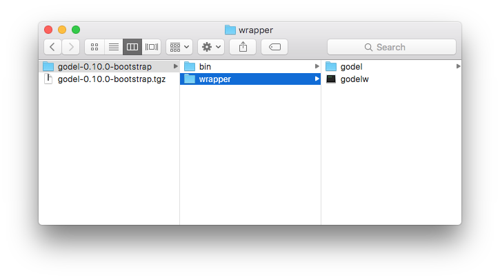
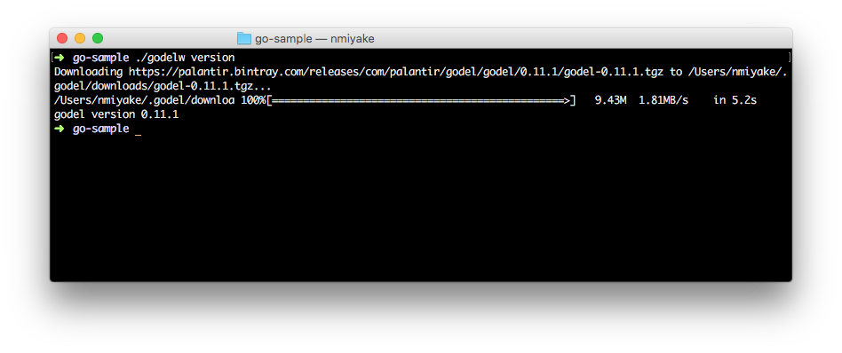
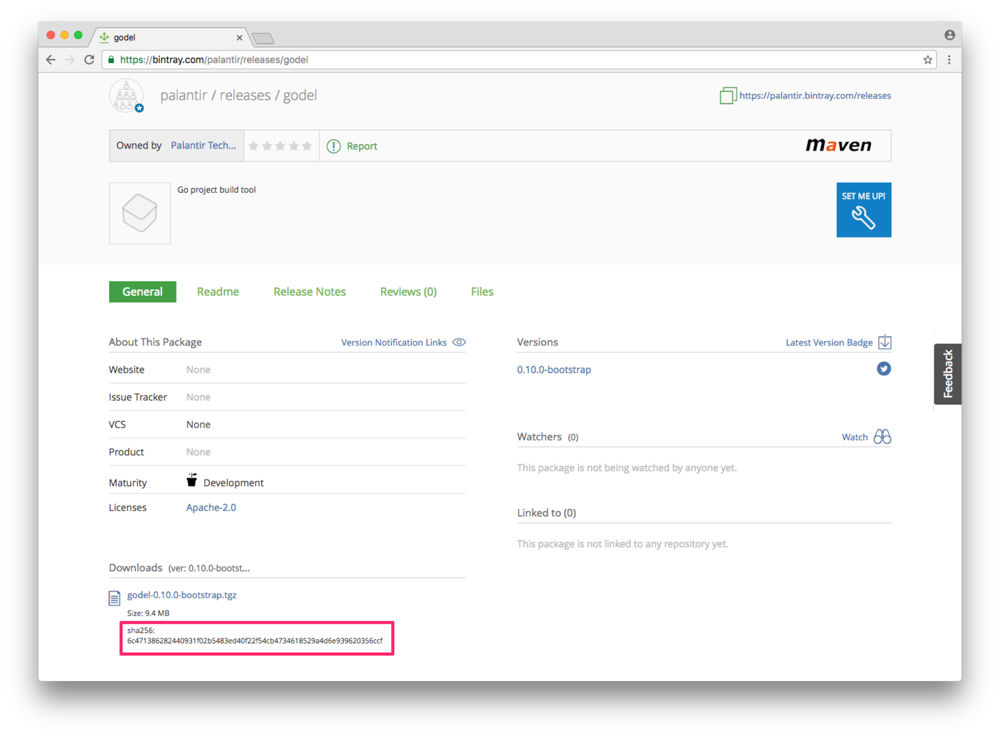

gödel is added to a project by adding the `godelw` script and `godel` configuration directory to the root directory of
the project. These files can be obtained from a gödel distribution or by copying them from an existing project that uses
gödel.

Download and install gödel from a distribution
----------------------------------------------

* Download the latest version of the gödel distribution from Bintray at https://bintray.com/palantir/releases/godel
* Expand the `.tgz` file and verify that the expanded directory contains a `wrapper` directory that contains the `godelw` script and the `godel` directory:



* Copy the `godelw` script and the `godel` directory to the top-level directory of the destination project:

```bash
> cp -r ~/Downloads/godel-0.10.0-bootstrap/wrapper/* $GOPATH/src/github.com/<USER>/<REPO>
```

* Find and add the checksum for the distribution (optional: see instructions at the end)
* Run `./godelw version` to verify that gödel has been installed correctly
  * If the gödel distribution has not been installed, invoking any gödel command causes the distribution to be downloaded and installed
  * If you do not want gödel to re-download the distribution, follow the instructions in the "Manually move gödel to expected location" section



* Check in the `godelw` script and `godel` directory as part of the version-controlled material of the project

Manually move gödel to expected location
----------------------------------------
The `godelw` script expects the gödel distribution directory to exist at `$GODEL_HOME/dists/godel-$VERSION` (if
`GODEL_HOME` is undefined, then `~/.godel` is used). If the distribution directory is not present at that location, the
script downloads the distribution from the URL specified in `godel/config/godel.properties`.

If you have already downloaded the gödel distribution and do not want the `godelw` script to download it again, you can
manually expand the distribution directory to the expected location as follows (assumes that `GODEL_HOME` is not set):

```bash
mkdir -p ~/.godel/dists
tar -C ~/.godel/dists -xzf ~/Downloads/godel-0.10.0-bootstrap.tgz
```

Alternatively, the expanded directory can also be moved/copied into place:

```bash
mkdir -p ~/.godel/dists
cp -r ~/Downloads/godel-0.10.0-bootstrap ~/.godel/dists
```

Add checksum
------------
If the `godelw` script cannot locate the `godel` binary, it downloads it from the URL specified in
`godel/godel.properties`. If a checksum is specified in `godel/godel.properties`, it is used to verify the integrity and
validity of the distribution downloaded from the URL.

The checksum is the SHA-256 checksum of the `.tgz` archive of the product. The checksum can be obtained from the
Bintray page for the distribution:



If a user has obtained a trusted distribution locally, it is also possible to manually compute the checksum. Here are
some examples of how to compute the SHA-256 checksum of a local file:

```bash
> openssl dgst -sha256 ~/Downloads/godel-0.10.0-bootstrap.tgz
SHA256(/Users/<USER>/Downloads/godel-0.10.0-bootstrap.tgz)= 6c471386282440931f02b5483ed40f22f54cb4734618529a4d6e939620356ccf
```

```bash
> shasum -a 256 ~/Downloads/godel-0.10.0-bootstrap.tgz
6c471386282440931f02b5483ed40f22f54cb4734618529a4d6e939620356ccf  /Users/<USER>/Downloads/godel-0.10.0-bootstrap.tgz
```

Once the digest value is obtained, open the `godel/config/godel.properties` file and enter the value after the
`distributionSHA256=` key. After doing so, the contents of the file should resemble the following:

```
distributionURL=https://palantir.bintray.com/releases/com/palantir/godel/godel/0.10.0-bootstrap/godel-0.10.0-bootstrap.tgz
distributionSHA256=6c471386282440931f02b5483ed40f22f54cb4734618529a4d6e939620356ccf
```
