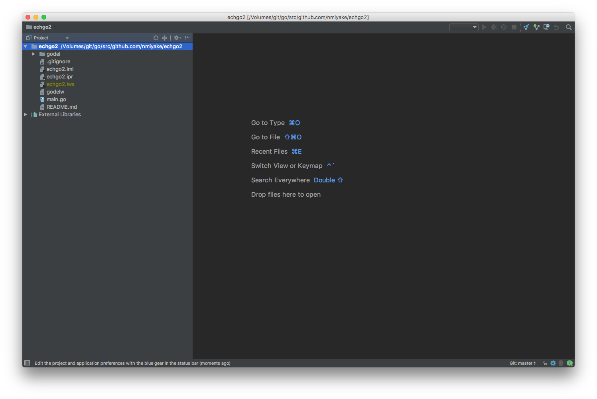

Summary
-------
`./godelw goland` generates the project files necessary to load a project in [GoLand](https://www.jetbrains.com/go/)
with "File Watchers" plugin configuration that runs `./godelw format` on modified files on save.

Tutorial start state
--------------------
* `${GOPATH}/src/${PROJECT_PATH}` exists, is the working directory and is initialized as a Git repository
* Project contains `godel` and `godelw`
* Project contains `main.go`

Create GoLand project file
--------------------------
Goland is a full-featured Go IDE with many convenient features, and gödel makes it easy to generate GoLand project files
for a project to start development on it with minimal overhead.

Run the following command to generate the IDE files:

```
➜ ./godelw goland
```

This generates an `.iml` and `.ipr` file for the project. The generated `.ipr` file can be opened in GoLand to reveal
that the project has been set up properly:



We do not want to commit the GoLand files to the repository, so we will create and commit a `.gitigore` file that
ignores these files:

```
➜ echo '*.iml
*.ipr
*.iws' > .gitignore
➜ git add .gitignore
➜ git commit -m "Add .gitignore file"
[master 0028157] Add .gitignore file
 1 file changed, 3 insertions(+)
 create mode 100644 .gitignore
```

Tutorial end state
------------------
* `${GOPATH}/src/${PROJECT_PATH}` exists, is the working directory and is initialized as a Git repository
* Project contains `godel` and `godelw`
* Project contains `main.go`
* Project contains `.gitignore` that ignores GoLand files

Tutorial next step
------------------
[Format Go files](https://github.com/palantir/godel/wiki/Format)

More
----
### File Watchers plugin
The project file generated by gödel configures the ["File Watchers" plugin](https://plugins.jetbrains.com/plugin/7177-file-watchers)
to run the `./godelw format` task to automatically format modified files on save. It is recommended that you install the
"File Watchers" plugin in GoLand to support this workflow. The "File Watchers" plugin is global to GoLand, so once it
is installed all projects can take advantage of it.

Verify that the "File Watchers" plugin is installed and working by doing the following:

* Open `main.go`, remove line 8 (the newline preceding `func main() {`) and save the file

If the "File Watchers" plugin is installed and the configuration generated by the `goland` task is working properly,
then the newline should automatically be re-added on save. This is because the GoLand project generated by gödel is
configured to run `./godelw format` on all modified files on save.
