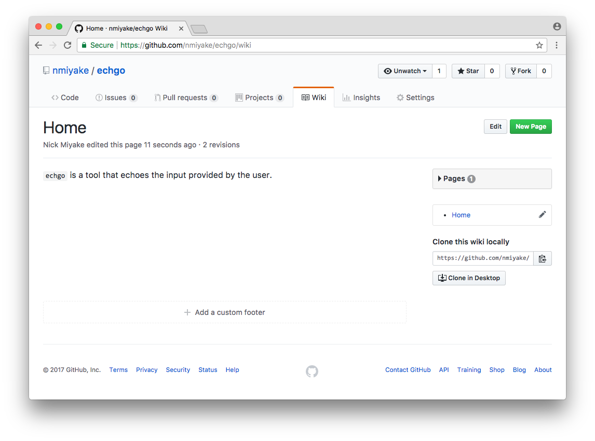

Summary
-------
The `github-wiki` task can be used to sync a particular directory with the GitHub wiki for a project.

Tutorial start state
--------------------

* `$GOPATH/src/github.com/nmiyake/echgo` exists and is the working directory
* Project contains `godel` and `godelw`
* Project contains `main.go`
* Project contains `.gitignore` that ignores IDEA files
* Project contains `echo/echo.go`, `echo/echo_test.go` and `echo/echoer.go`
* `godel/config/dist.yml` is configured to build `echgo`
* Project is tagged as 0.0.1
* `godel/config/dist.yml` is configured to create distributions for `echgo`
* Project is tagged as 0.0.2
* Go files have license headers
* `godel/config/generate.yml` is configured to generate string function
* `godel/config/exclude.yml` is configured to ignore all `.+_string.go` files
* `integration_test` contains integration tests
* `godel/config/test.yml` is configured to specify the "integration" tag

([Link](https://github.com/nmiyake/echgo/tree/676aad36a5c355af826397be682f49bbb4a9ed20))

Sync a docs directory with a GitHub wiki
----------------------------------------

We will now add documentation for `echgo` and sync it with the GitHub wiki for the project.

Run the following to create a "docs" directory and add some documentation and commit the changes:

```
➜ mkdir -p docs
➜ echo '* [Home](https://github.com/nmiyake/echgo/wiki)' > docs/_Sidebar.md
➜ echo '`echgo` is a tool that echoes the input provided by the user.' > docs/Home.md
➜ git add docs
➜ git commit -m "Add documentation"
[master 17c7406] Add documentation
 2 files changed, 2 insertions(+)
 create mode 100644 docs/Home.md
 create mode 100644 docs/_Sidebar.md
```

The `github-wiki` task requires a project to have an existing GitHub wiki before it can work. In order to do this, one
needs to be created using the GitHub UI. Navigate to the wiki for the project (for this example, the URL is
https://github.com/nmiyake/echgo/wiki), click on the "Create the first page" button and click on the "Save Page" button
to save the first page with the default content.

Now that the wiki exists, run the `github-wiki` task to publish the `docs` directory to the GitHub wiki:

```
➜ ./godelw github-wiki --docs-dir docs --repository=git@github.com:nmiyake/echgo.wiki.git
Pushing content of docs to git@github.com:nmiyake/echgo.wiki.git...
```

This commits the contents of the `docs` directory to the GitHub wiki repository:



Tutorial end state
------------------

* `$GOPATH/src/github.com/nmiyake/echgo` exists and is the working directory
* Project contains `godel` and `godelw`
* Project contains `main.go`
* Project contains `.gitignore` that ignores IDEA files
* Project contains `echo/echo.go`, `echo/echo_test.go` and `echo/echoer.go`
* `godel/config/dist.yml` is configured to build `echgo`
* Project is tagged as 0.0.1
* `godel/config/dist.yml` is configured to create distributions for `echgo`
* Project is tagged as 0.0.2
* Go files have license headers
* `godel/config/generate.yml` is configured to generate string function
* `godel/config/exclude.yml` is configured to ignore all `.+_string.go` files
* `integration_test` contains integration tests
* `godel/config/test.yml` is configured to specify the "integration" tag
* `docs` contains documentation

([Link](https://github.com/nmiyake/echgo/tree/17c7406291096306e92c6f82da2df09388766693))

Tutorial next step
------------------
[Verify project](https://github.com/palantir/godel/wiki/Verify)

More
----

### Motivation

GitHub wikis are often a convenient medium for providing documentation for a project. Although GitHub wikis are backed
by a git repository, unlike primary repositories, there is no UI provided for issuing pull requests or conducting code
reviews. Furthermore, because the GitHub wiki repository is separate from a project's primary repository, checking
out only the primary repository does not provide the documentation.

gödel provides a `github-wiki` task that provides a workflow that addresses all of the above concerns. The `github-wiki`
task can be used to sync the contents of a directory in a project with a GitHub wiki repository. With this mechanism,
documentation changes are done as PRs on the primary repository and the documentation lives in a directory in the
repository. The `github-wiki` task can then be used to push the contents of the documentation directory to the GitHub
wiki, which provides the navigation features offered by GitHub wikis.

Note that the `github-wiki` task only performs a one-way publish -- any changes that are made to the wiki through the UI
will be overwritten by the `github-wiki` publish task (the `github-wiki` task creates a commit that make the state of
the GitHub wiki mirror the input directory exactly). However, the changes will still exist in the commit history of the
repository, so any content that was added manually or through some other mechanism can be recovered from git history if
necessary.
