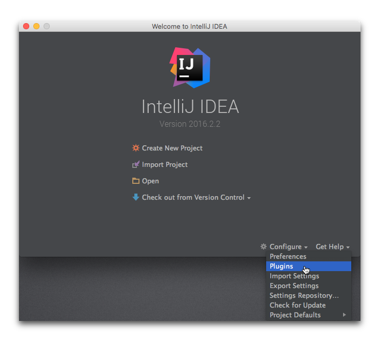
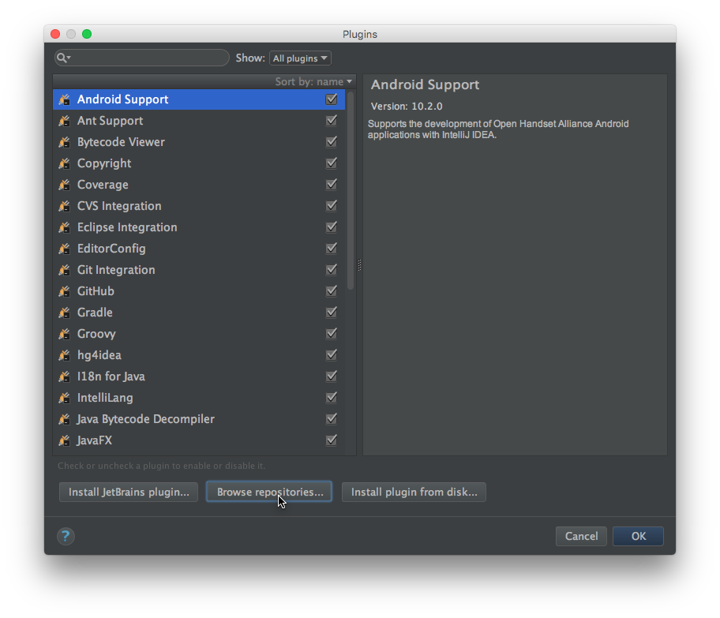
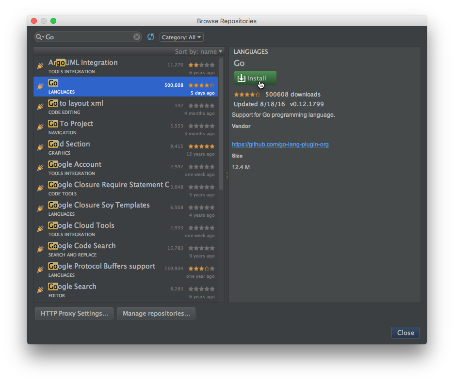
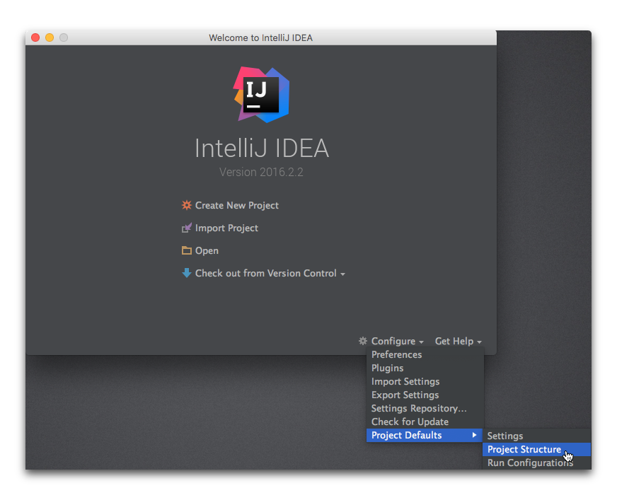
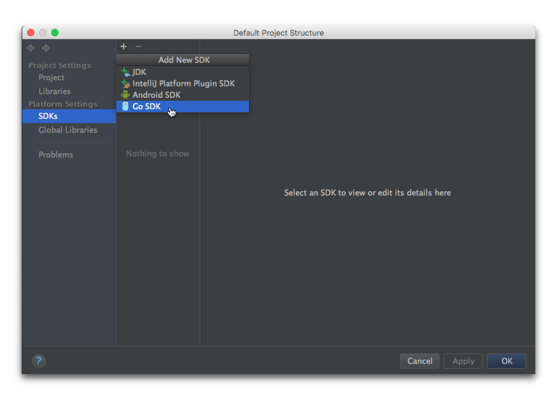
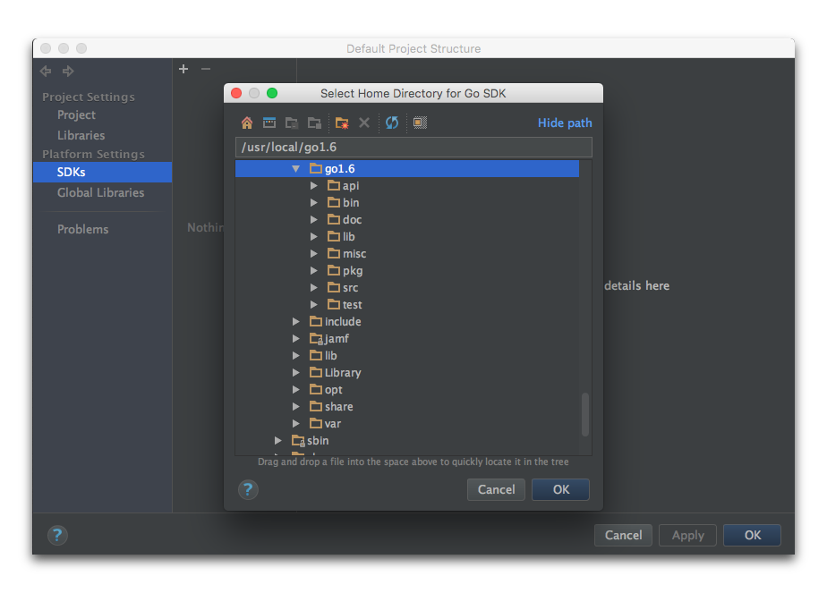
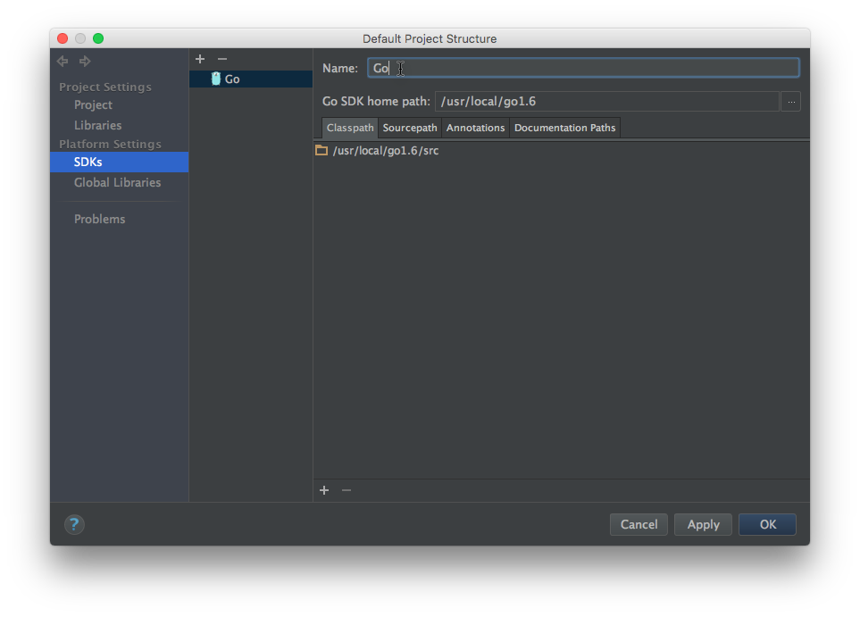

In order to use IntelliJ IDEA effectively with the projects generated by gödel, a few one-time setup steps are required.

# Install Go Plugin
The [Go Plugin for IntelliJ](https://github.com/go-lang-plugin-org/go-lang-idea-plugin) plugin is required for working
with Go projects in IntelliJ.

1. Open the "Plugins" configuration dialog:

2. Click on the "Browse repositories..." button.

3. Search for "Go" and install the "Go" plugin under the "Languages" category.

4. Restart IntelliJ when prompted to do so.

# Install File Watchers Plugin
The [File Watchers](https://plugins.jetbrains.com/plugin/7177) plugin is required to run automated tasks on the files in
a project in IntelliJ.

1. Open the "Plugins" configuration dialog.

2. Click on the "Browse repositories..." button.

3. Search for "File Watchers" and install the "File Watchers" plugin under the "Build" category.

4. Restart IntelliJ when prompted to do so.

# Add a Go SDK named "Go"

The gödel `idea` task assumes the existence of a go SDK named "Go".

1. Open the "Project Structure" configuration dialog:

2. Select the "SDKs" pane under "Platform Settings", click on the "+" button and choose "Go SDK".

3. Navigate to the root directory of the go installation that should be used for builds and select it.

4. Ensure that the name of the SDK is "Go".

