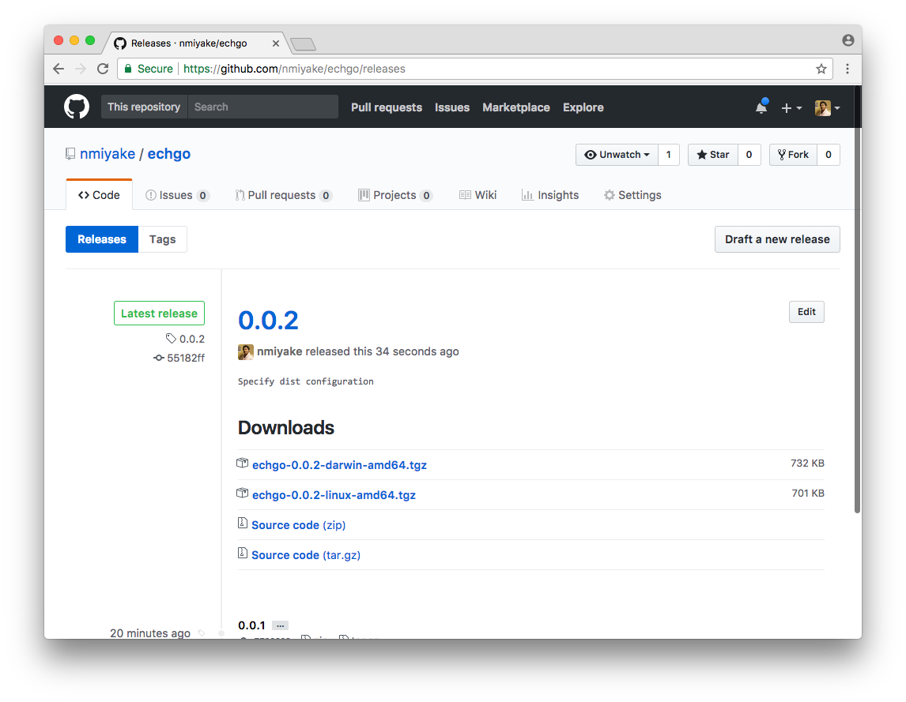

Summary
-------
`./godelw publish` publishes distributions for the products in the project based on the dist configuration.

Tutorial start state
--------------------

* `$GOPATH/src/github.com/nmiyake/echgo` exists and is the working directory
* Project contains `godel` and `godelw`
* Project contains `main.go`
* Project contains `.gitignore` that ignores IDEA files
* Project contains `echo/echo.go`, `echo/echo_test.go` and `echo/echoer.go`
* `godel/config/dist.yml` is configured to build `echgo`
* Project is tagged as 0.0.1
* `godel/config/dist.yml` is configured to create distributions for `echgo`

([Link](https://github.com/nmiyake/echgo/tree/55182ff79dd28048782fb240920d6f2d90b453da))

Publish
-------

Our project is now configured to build binaries and distributions. The next step is to have a way to publish these
distributions so that they can be downloaded and consumed by users.

The `publish` task can be used to publish the distributions created by the `dist` task. The `publish` task supports
publishing artifacts to the following common distribution platforms:

* GitHub releases
* Bintray
* Artifactory

The publish task is most commonly run in a CI environment, but it is possible to run locally as well. We will walk
through an example of publishing this product using GitHub releases.

In order to publish this product on GitHub, we will need a GitHub repository and a GitHub API token. This tutorial uses
`github.com/nmiyake/echgo` as the GitHub repository. To follow along with this tutorial, create a repository in your own
GitHub space called `echgo`. GitHub provides [instructions](https://help.github.com/articles/create-a-repo/) for this if
you have not done so before.

Because we already have a repository locally, you can follow the [instructions provided by GitHub](https://help.github.com/articles/adding-an-existing-project-to-github-using-the-command-line/)
for pushing a local Git repository to the newly created repository. The following is an example of pushing the
local repository to the `nmiyake/echgo` GitHub repository set up using SSH:

```
➜ git remote add origin git@github.com:nmiyake/echgo.git
➜ git push -u origin master
Counting objects: 51, done.
Delta compression using up to 8 threads.
Compressing objects: 100% (41/41), done.
Writing objects: 100% (51/51), 7.29 KiB | 0 bytes/s, done.
Total 51 (delta 16), reused 0 (delta 0)
remote: Resolving deltas: 100% (16/16), done.
To git@github.com:nmiyake/echgo.git
 * [new branch]      master -> master
Branch master set up to track remote branch master from origin by rebasing.
```

We will perform a release for a 0.0.2 of our product. Create a `0.0.2` tag and push the tags to the repository:

```
➜ git tag 0.0.2
➜ git push origin --tags
Total 0 (delta 0), reused 0 (delta 0)
To git@github.com:nmiyake/echgo.git
 * [new tag]         0.0.1 -> 0.0.1
 * [new tag]         0.0.2 -> 0.0.2
```

Publishing to GitHub requires an access token. Follow the [GitHub instructions](https://help.github.com/articles/creating-a-personal-access-token-for-the-command-line/)
for creating a personal access token. For this example, the token requires the `public_repo` scope.

Once you have created the token, run the following command, replacing `nmiyake` with your own username and `<token>`
with your GitHub token:

```
➜ ./godelw publish github --url https://api.github.com/ --user nmiyake --password <token> --owner nmiyake --repository echgo
Building echgo for darwin-amd64 at /Volumes/git/go/src/github.com/nmiyake/echgo/build/0.0.2/darwin-amd64/echgo
Building echgo for linux-amd64 at /Volumes/git/go/src/github.com/nmiyake/echgo/build/0.0.2/linux-amd64/echgo
Finished building echgo for linux-amd64 (0.385s)
Finished building echgo for darwin-amd64 (0.386s)
Creating distribution for echgo at /Volumes/git/go/src/github.com/nmiyake/echgo/dist/echgo-0.0.2-darwin-amd64.tgz, /Volumes/git/go/src/github.com/nmiyake/echgo/dist/echgo-0.0.2-linux-amd64.tgz
Finished creating distribution for echgo
Creating distribution for echgo at /Volumes/git/go/src/github.com/nmiyake/echgo/dist/echgo-0.0.2-darwin-amd64.tgz, /Volumes/git/go/src/github.com/nmiyake/echgo/dist/echgo-0.0.2-linux-amd64.tgz
Finished creating distribution for echgo
Creating GitHub release 0.0.2 for nmiyake/echgo...done
Uploading /Volumes/git/go/src/github.com/nmiyake/echgo/dist/echgo-0.0.2-darwin-amd64.tgz to https://uploads.github.com/repos/nmiyake/echgo/releases/8141225/assets?name=echgo-0.0.2-darwin-amd64.tgz
 732.31 KB / 732.31 KB [====================================================================================] 100.00% 0s
Uploading /Volumes/git/go/src/github.com/nmiyake/echgo/dist/echgo-0.0.2-linux-amd64.tgz to https://uploads.github.com/repos/nmiyake/echgo/releases/8141225/assets?name=echgo-0.0.2-linux-amd64.tgz
 700.54 KB / 700.54 KB [====================================================================================] 100.00% 0s
```

As described by the output, the `publish` task has created a GitHub release called `0.0.2` (the name of the tag) and
has uploaded the distribution artifacts to the release.

Navigate to the "releases" section of the repository to verify that the distribution artifacts were uploaded:



The publish task can be configured to run in a CI environment on release tags.

Tutorial end state
------------------

* `$GOPATH/src/github.com/nmiyake/echgo` exists and is the working directory
* Project contains `godel` and `godelw`
* Project contains `main.go`
* Project contains `.gitignore` that ignores IDEA files
* Project contains `echo/echo.go`, `echo/echo_test.go` and `echo/echoer.go`
* `godel/config/dist.yml` is configured to build `echgo`
* Project is tagged as 0.0.1
* `godel/config/dist.yml` is configured to create distributions for `echgo`
* Project is tagged as 0.0.2

([Link](https://github.com/nmiyake/echgo/tree/55182ff79dd28048782fb240920d6f2d90b453da))

Tutorial next step
------------------

[Generate license headers](https://github.com/palantir/godel/wiki/License-headers)

More
----

### POM publishing and local publishing

The `Artifactory` and `Bintray` publish tasks generate Maven-style [POM](https://maven.apache.org/guides/introduction/introduction-to-the-pom.html)
descriptors that are uploaded along with the artifacts. The product name and version for the POM are determined based on
the build configuration and repository state. The group ID must be specified as a separate top-level key called
`group-id`.

Run the following to add a `group-id` field:

```
➜ echo 'products:
  echgo:
    build:
      main-pkg: .
      version-var: main.version
      os-archs:
        - os: darwin
          arch: amd64
        - os: linux
          arch: amd64
    dist:
      dist-type:
        type: os-arch-bin
group-id: com.palantir.echgo' > godel/config/dist.yml
```

It can be helpful to see the exact output that will be generated for a distribution before trying to publish it
remotely. In order to facilitate this for POM-based publishing, publish supports a `local` type. Run the following to
publish artifacts locally:

```
➜ ./godelw publish local
Building echgo for linux-amd64 at /Volumes/git/go/src/github.com/nmiyake/echgo/build/0.0.2.dirty/linux-amd64/echgo
Building echgo for darwin-amd64 at /Volumes/git/go/src/github.com/nmiyake/echgo/build/0.0.2.dirty/darwin-amd64/echgo
Finished building echgo for darwin-amd64 (0.384s)
Finished building echgo for linux-amd64 (0.389s)
Creating distribution for echgo at /Volumes/git/go/src/github.com/nmiyake/echgo/dist/echgo-0.0.2.dirty-darwin-amd64.tgz, /Volumes/git/go/src/github.com/nmiyake/echgo/dist/echgo-0.0.2.dirty-linux-amd64.tgz
Finished creating distribution for echgo
Creating distribution for echgo at /Volumes/git/go/src/github.com/nmiyake/echgo/dist/echgo-0.0.2.dirty-darwin-amd64.tgz, /Volumes/git/go/src/github.com/nmiyake/echgo/dist/echgo-0.0.2.dirty-linux-amd64.tgz
Finished creating distribution for echgo
Copying /Volumes/git/go/src/github.com/nmiyake/echgo/dist/echgo-0.0.2.dirty.pom to /Users/nmiyake/.m2/repository/com/palantir/echgo/echgo/0.0.2.dirty/echgo-0.0.2.dirty.pom
Copying /Volumes/git/go/src/github.com/nmiyake/echgo/dist/echgo-0.0.2.dirty-darwin-amd64.tgz to /Users/nmiyake/.m2/repository/com/palantir/echgo/echgo/0.0.2.dirty/echgo-0.0.2.dirty-darwin-amd64.tgz
Copying /Volumes/git/go/src/github.com/nmiyake/echgo/dist/echgo-0.0.2.dirty-linux-amd64.tgz to /Users/nmiyake/.m2/repository/com/palantir/echgo/echgo/0.0.2.dirty/echgo-0.0.2.dirty-linux-amd64.tgz
```

By default, the task uses a Maven-style target and writes the output in a path under `~/.m2/repository`. This can be
customized using the `--path` flag. Verify that the content of the POM is valid:

```
➜ cat ~/.m2/repository/com/palantir/echgo/echgo/"$(./godelw project-version)"/echgo-"$(./godelw project-version)".pom
<?xml version="1.0" encoding="UTF-8"?>
<project xsi:schemaLocation="http://maven.apache.org/POM/4.0.0 http://maven.apache.org/xsd/maven-4.0.0.xsd" xmlns="http://maven.apache.org/POM/4.0.0"
xmlns:xsi="http://www.w3.org/2001/XMLSchema-instance">
<modelVersion>4.0.0</modelVersion>
<groupId>com.palantir.echgo</groupId>
<artifactId>echgo</artifactId>
<version>0.0.2.dirty</version>
<packaging>tgz</packaging>
</project>
```

Revert these changes by running the following:

```
➜ git checkout -- godel/config/dist.yml
```

### Artifactory publishing

The `publish` task supports publishing artifacts to Artifactory. The general call looks like the following:

```
./godelw publish artifactory --url https://artifactory.domain.com --repository dist-repo --user <username> --password <password>
```

A call of this form results in a publish call of the following form:

```
https://artifactory.domain.com/artifactory/dist-repo/<group-id>/echgo/0.0.2/echgo-0.0.2.tgz
```

The Artifactory publish task uses the Artifactory API to compute the SHA-256 checksums for the uploaded artifacts.

### Bintray publishing

The `publish` task supports publishing artifacts to Bintray. The general call looks like the following:

```
./godelw publish bintray --url https://api.bintray.com --subject org --repository releases --user <user> --password <password> --publish --downloads-list
```

A call of this form results in a publish call of the following form:

```
https://api.bintray.com/content/org/releases/echgo/0.0.2/<group-id>/echgo/0.0.2/echgo-0.0.2.tgz
```

The `--publish` flag triggers a Bintray "release" action and the `--downloads-list` flag adds the artifact to the
downloads list of the Bintray page.
